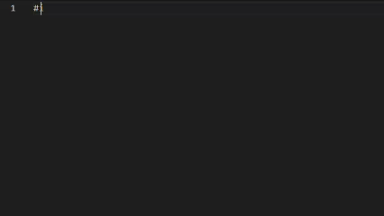

  

# Hi, I'm Dhyey

### IIITV CSE

My interests lie in **AI/ML, software development, and game development**.
I've worked on projects spanning **AI engineering, machine learning, and full stack development**.

  
  &nbsp;&nbsp;
  
  &nbsp;&nbsp;
  

---

## Tech Stack
<!--
**Languages**

  

**AI / ML**

  

**Development**

  

**Tools**

  

-->

<table>
<tr>
<td><b>Languages</b></td>
<td>
  
</td>
</tr>

<tr>
<td><b>AI / ML</b></td>
<td>
  
</td>
</tr>

<tr>
<td><b>Development</b></td>
<td>
  
</td>
</tr>

<tr>
<td><b>Tools</b></td>
<td>
  
</td>
</tr>
</table>

---

## Featured Projects

<table>
<tr>
<td width="50%" valign="top">

### 🔬 Research Paper Assistant

**Multimodal AI · RAG · Full Stack**

An AI-powered research assistant built with **RAG** and multimodal LLM capabilities to accelerate the literature review process in research.

**FastAPI · MongoDB · Pinecone · Gemini · React**

<a href="https://github.com/dhyeyraval/Research_Assistant">View Repository →</a>

</td>

<td width="50%" valign="top">

### 🏓 Pong AI

**Reinforcement Learning · PyTorch**

A Pong game and RL environment built from scratch, where an agent learns to play through **exploration, interaction and custom rewards**.

**Python · PyTorch · Pygame**

<a href="https://github.com/dhyeyraval/PongAI">View Repository →</a>

</td>
</tr>

<tr>
<td width="50%" valign="top">

### 🛰️ Plasma Region Classification & Bow Shock Detection

**ML · Research · Hybrid CNN**

Machine-learning-based analysis of **plasma regions and terrestrial bow-shock crossings** using data from NASA's MMS mission.

**Python · Tensorflow**

<a href="https://github.com/dhyeyraval/Bow_Shock_Prediction">View Repository →</a>

</td>

<td width="50%" valign="top">

### 🎓 AcadAssist

**Full Stack Application**

An academic assistance platform combining **AI study support, resource management, task scheduling, summarization, plagiarism detection, and study-group matching**.

**Python · PyQt6 · PostgreSQL · Google Drive**

<a href="https://github.com/dhyeyraval/AcadAssist2.0">View Repository →</a>

</td>
</tr>
</table>

---
<!-- 
## Stats

  
  

  

---

## Currently

Learning, experimenting, and occasionally breaking things.

Right now I'm focused on:

* 🌐 Open source
* 🧩 DSA & problem solving
* 🤖 AI/ML & computer vision
* 🛠️ Building better software

---
-->

## 🏆 Certifications

* [**Machine Learning Specialization**](https://coursera.org/share/d6ff5c87450d273855007d99b43b972f) - Andrew Ng, Coursera
* [**Fundamentals of Deep Learning**](https://learn.nvidia.com/certificates?id=FC8m5hYGT6iENn2fdQfH6A##) - NVIDIA DLI
* [**Microsoft Azure AI Fundamentals**](https://learn.microsoft.com/en-us/users/dhyeyraval-0828/credentials/e8001f5ef8a4ce11) - Microsoft 

---

  <i>Better than Yesterday</i>

